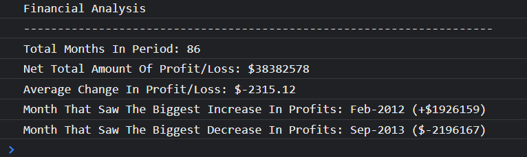

# Console Finances

## Description
The motivation behind this challenge was to use JavaScript to analyse a large array of data to calculate the following:
- The Total Number Of Months In The Set Of Data.
- The Net Total Amount Of Profit/Losses Over The Entire Period.
- The Average Change In Profit/Losses Over The Entire Period.
- The Month Included In The Period That Saw The Biggest Increase In Profits.
- The Month Included In The Period That Saw The Biggest Increase In Losses.

Throughout working on this challenge I have learnt the following:
- Arrays
- Nested Arrays
- Array Methods
- Loops
- Push
- Math.min( )
- Math.max ( )
#

## Table Of Contents
- [Usage](#usage)
- [Credits](#credits)
- [Deployment](#deployment)
- [License](#license)

#
## Usage
To access the work of this challenge, you will need to access the console of the web browser. This can be done by either right clicking and selecting "Inspect" or using the shortcut Ctrl + Shift + C. When the web page first loads the user will be greeted with an alert advising them to open the console. When opening the console the results of the calculations and acceptance criteria will be visible in the following format:

It is important to note here that the outcomes featured on the console is flexible so if data is added or removed to the original array, the results featured on the console will update.

#

## Credits
Throughout working on this challenge, I sought the knowledge and advice from multiple sources including:
- https://www.w3schools.com/js/js_arrays.asp
- https://plainenglish.io/blog/understanding-the-nested-arrays-fbf3ab13c2b4
- https://www.w3schools.com/js/js_loop_for.asp
- https://www.w3schools.com/js/js_array_methods.asp
- https://www.w3schools.com/jsref/jsref_push.asp
- https://stackoverflow.com/questions/4156101/copy-array-items-into-another-array#:~:text=Provided%20your%20arrays%20are%20not,a%20list%20of%20function%20parameters.
- https://www.geeksforgeeks.org/how-to-find-the-sum-of-all-elements-of-a-given-array-in-javascript/
- https://www.w3schools.com/jsref/jsref_number_nan.asp#:~:text=In%20JavaScript%2C%20NaN%20is%20short,the%20same%20as%20the%20Number.
- https://www.codeproject.com/Questions/851352/Why-do-I-keep-getting-NaN-as-my-answer
- https://www.w3schools.com/js/js_arithmetic.asp#:~:text=Dividing,operator%20(%20%2F%20)%20divides%20numbers.
- https://stackoverflow.com/questions/11832914/how-to-round-to-at-most-2-decimal-places-if-necessary
- https://medium.com/@vladbezden/how-to-get-min-or-max-of-an-array-in-javascript-1c264ec6e1aa
- https://developer.mozilla.org/en-US/docs/Web/JavaScript/Reference/Global_Objects/Math/max
- https://www.w3schools.com/jsref/jsref_max.asp
- https://www.w3schools.com/jsref/jsref_min.asp
- https://developer.mozilla.org/en-US/docs/Web/JavaScript/Reference/Global_Objects/Math/min

#
## Deployment
Below is the link to the deployed web page using GitHub Pages:
- https://maccersm8.github.io/Console-Finances/

#
## License
Copyright (c) 2022 Maisie McDonald

Permission is hereby granted, free of charge, to any person obtaining a copy
of this software and associated documentation files (the "Software"), to deal
in the Software without restriction, including without limitation the rights
to use, copy, modify, merge, publish, distribute, sublicense, and/or sell
copies of the Software, and to permit persons to whom the Software is
furnished to do so, subject to the following conditions:

The above copyright notice and this permission notice shall be included in all
copies or substantial portions of the Software.

THE SOFTWARE IS PROVIDED "AS IS", WITHOUT WARRANTY OF ANY KIND, EXPRESS OR
IMPLIED, INCLUDING BUT NOT LIMITED TO THE WARRANTIES OF MERCHANTABILITY,
FITNESS FOR A PARTICULAR PURPOSE AND NONINFRINGEMENT. IN NO EVENT SHALL THE
AUTHORS OR COPYRIGHT HOLDERS BE LIABLE FOR ANY CLAIM, DAMAGES OR OTHER
LIABILITY, WHETHER IN AN ACTION OF CONTRACT, TORT OR OTHERWISE, ARISING FROM,
OUT OF OR IN CONNECTION WITH THE SOFTWARE OR THE USE OR OTHER DEALINGS IN THE
SOFTWARE.